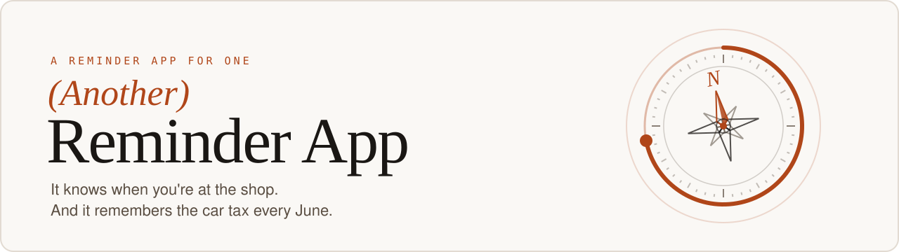
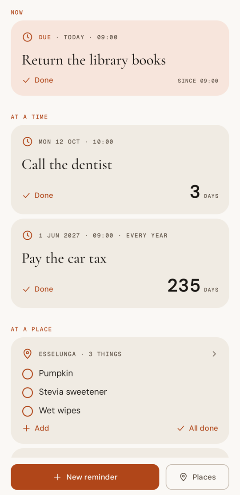
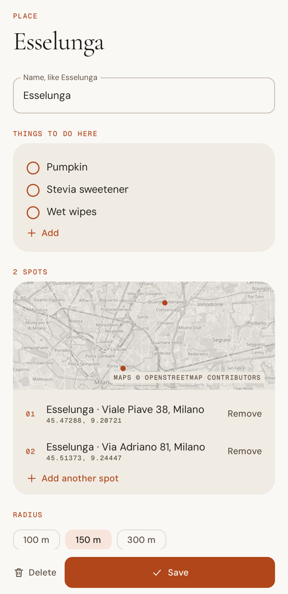
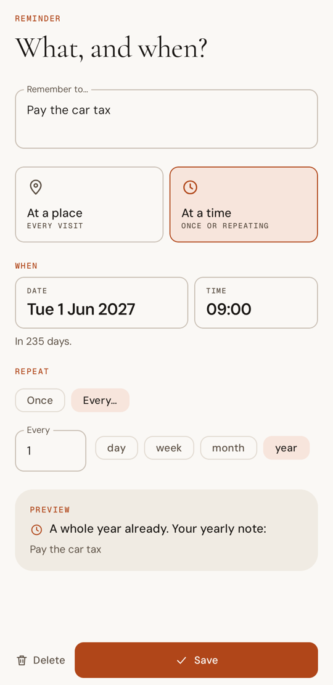
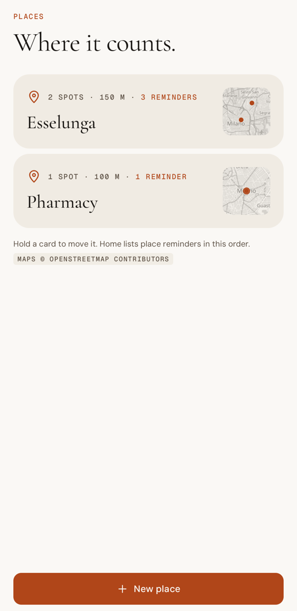

<picture>
  <source media="(prefers-color-scheme: dark)" srcset="docs/assets/banner-dark.svg">
  
</picture>

<p>
  
  
  
  
  
  <a href="https://eduarddragu.dev"></a>
</p>

**(Another) reminder app, built for me: it knows when I'm at the shop, keeps one list per place, and remembers the car tax every June, a week ahead.**

I'm always forgetting the grocery list in my mind that I was supposed to remember, so now I get notified whenever I'm actually at the shop. For the things that do have a date, it doesn't trust a single notification: it warns me a week before, the evening before, and then keeps asking, more and more patiently, until it's done.

> Built for one Pixel, installed as a sideloaded APK. Sibling of [(Another) Habit Tracker](https://github.com/eduarddragu/another-habit-tracker), same palette, same type.

## Screens

Light and dark, both native. The light ones are here.

<p align="center">
  
  
  
  
  
</p>
<p align="center"><sub>Home · Dates and lists · A place · Every June · Places</sub></p>

## What it does

**One list per shop.** A place is a kind of shop, not an address: "Esselunga" is every Esselunga I go to. Everything I need there is one list on one card. I tick things off one by one or all at once, tap a line to change it, and "Add" a new one right there, one per Enter, like a shopping list.

**Notices I'm there.** After two minutes inside a shop, one notification lists everything I need there. Driving past doesn't count. It sounds kind, not bossy: "Nice timing. At Esselunga you meant to:".

| Radius | For |
|---|---|
| 100 m | a shop in a street, without going off next door |
| 150 m | the default |
| 300 m | a mall and its car park |

**Finds the shops.** I search a shop or an address ("Esselunga viale Piave"), nearest first. Or I tap "Where I am" while I'm there, share the shop from Google Maps, or paste a Maps link.

**Remembers dates, early and late.** A reminder with a date fires once or repeats: every N days, weeks, months or years, like the car tax every June. One notification is easy to swipe away, so it doesn't stop there:

| When | Sounds like |
|---|---|
| A week before, at 10:00 | "One week to go, just so you know:" |
| The evening before, at 20:00 | "Tomorrow, this one. Get ready:" |
| On time | "Right on time. You asked me to say:" |
| Not done: after 1, 2, 4, 8, 16 hours | "Still on your list:" |
| Then once a day, for a week | "This was for yesterday. Still on?" |

Nothing between 22:00 and 08:00. Done from the notification can be undone for ten seconds.

**Opens on a compass.** Home says what's next ("Call the dentist, in 3 days.") around an old compass whose rim counts down to the next date. Under it: what's due, what's coming, and one card per shop.

## Under the hood

- Kotlin, Jetpack Compose and Material 3, in the palette and type of [eduarddragu.dev](https://eduarddragu.dev): Cormorant Garamond, DM Sans and Geist Mono, bundled under the SIL Open Font License (`app/src/main/assets/licenses/`).
- One JSON file in the app's storage. No database.
- Shops are Play services geofences, registered again only when needed (after a reboot, an update, or location coming back on), so opening the app never resets the two minutes.
- Dates are exact alarms on the phone, set again after a reboot, an update or a time zone change.
- The maps are OpenStreetMap tiles, toned to the palette.
- The logic that matters (repeats, the notification sequence, countdowns, Maps links, search results) is plain Kotlin with unit tests.

```
app/src/main/java/dev/eduarddragu/anotherreminderapp/
├── domain/     pure logic: data model, repeats, nudges, copy, fences, Maps links, map maths
├── data/       the JSON store, place search, map tiles, Maps link expansion
├── triggers/   alarms, geofences, notifications and their receivers
├── ui/         Compose screens and components (the compass, the map, the place list)
└── theme/      palette, type and motion
```

## Build and install

You need JDK 21 (the build targets Java 17), the Android SDK, and a phone with Google Play services and USB or wireless debugging on.

```bash
scripts/install.sh            # release build, installed in place and launched
scripts/install.sh debug      # debug build
./gradlew testDebugUnitTest   # unit tests, on the JVM
```

### Signing

An update keeps the app's data only if it's signed with the same key as the installed version, so the key stays out of the repository. The build reads it from `~/.gradle/gradle.properties`, with the same `aht.*` names as the habit tracker (I use one key for both):

```properties
aht.storeFile=/absolute/path/to/your-key.jks
aht.storePassword=...
aht.keyAlias=...
aht.keyPassword=...
```

Without them the build uses the debug key, which is fine for trying it out; the install script refuses it, because the phone would reject it as an update. Never run `connectedAndroidTest` on a phone you use: instrumented tests uninstall the app, data included.

## Permissions

| Permission | Why |
|---|---|
| Location, "Allow all the time" | geofences fire while the app is closed. Android grants it only from its settings page, which Home's card opens |
| Notifications | the reminders themselves |
| Exact alarms | time reminders on the minute |
| Run at startup | alarms and geofences are set again after a reboot |
| Internet | the place search, the map tiles, and expanding a shared Maps link (see Privacy) |

Home lists whatever is missing, with the one tap that fixes it.

## Privacy

Places and reminders stay on the phone, in one file that isn't part of the Google account backup (a spot can be your home). No accounts, no analytics. The app goes online only when you ask it to:

- searching a shop or an address: the search goes to OpenStreetMap's Nominatim;
- the maps: tiles come from OpenStreetMap and are kept for 30 days;
- a Google Maps link you share or paste: it's followed on Google's own hosts to find the place.

Both OpenStreetMap services are used within their rules: at most one search a second, at most two map downloads at once.

## License

[GPL v3](LICENSE). Take it, change it, ship your own version, as long as yours stays open too. The bundled fonts keep their own SIL Open Font License, and map data is © [OpenStreetMap contributors](https://www.openstreetmap.org/copyright).
